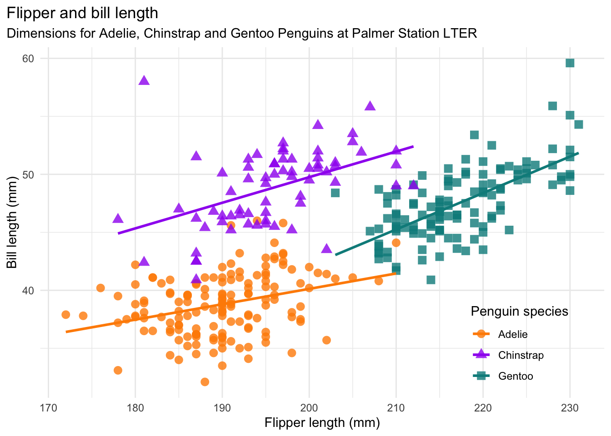
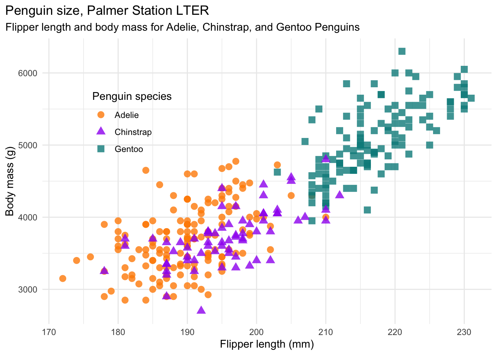
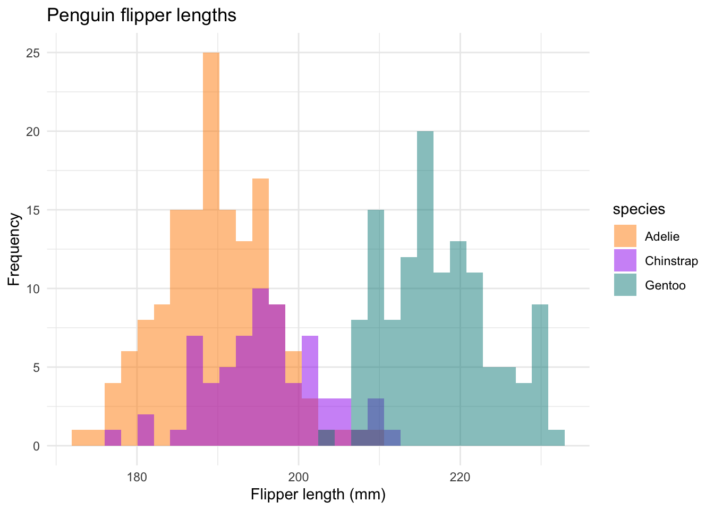

<!-- README.md is generated from README.Rmd. Please edit that file -->

# palmerpenguins <a href='https://allisonhorst.github.io/palmerpenguins/'></a>

<!-- badges: start -->

[](https://doi.org/10.5281/zenodo.3960218)
[](https://cran.r-project.org/package=palmerpenguins)

<!-- badges: end -->

The goal of palmerpenguins is to provide a great dataset for data
exploration & visualization, as an alternative to `iris`.



## Installation

You can install the released version of palmerpenguins from
[CRAN](https://CRAN.R-project.org) with:

``` r
install.packages("palmerpenguins")
```

To install the development version from [GitHub](https://github.com/)
use:

``` r
# install.packages("remotes")
remotes::install_github("allisonhorst/palmerpenguins")
```

## About the data

Data were collected and made available by [Dr. Kristen
Gorman](https://www.uaf.edu/cfos/people/faculty/detail/kristen-gorman.php)
and the [Palmer Station, Antarctica
LTER](https://pallter.marine.rutgers.edu/), a member of the [Long Term
Ecological Research Network](https://lternet.edu/).

The palmerpenguins package contains two datasets.

``` r
library(palmerpenguins)
data(package = 'palmerpenguins')
```

One is called `penguins`, and is a simplified version of the raw data;
see `?penguins` for more info:

``` r
head(penguins)
#> # A tibble: 6 × 8
#>   species island bill_length_mm bill_depth_mm flipper_length_… body_mass_g sex  
#>   <fct>   <fct>           <dbl>         <dbl>            <int>       <int> <fct>
#> 1 Adelie  Torge…           39.1          18.7              181        3750 male 
#> 2 Adelie  Torge…           39.5          17.4              186        3800 fema…
#> 3 Adelie  Torge…           40.3          18                195        3250 fema…
#> 4 Adelie  Torge…           NA            NA                 NA          NA <NA> 
#> 5 Adelie  Torge…           36.7          19.3              193        3450 fema…
#> 6 Adelie  Torge…           39.3          20.6              190        3650 male 
#> # … with 1 more variable: year <int>
```

The second dataset is `penguins_raw`, and contains all the variables and
original names as downloaded; see `?penguins_raw` for more info.

``` r
head(penguins_raw)
#> # A tibble: 6 × 17
#>   studyName `Sample Number` Species          Region Island Stage `Individual ID`
#>   <chr>               <dbl> <chr>            <chr>  <chr>  <chr> <chr>          
#> 1 PAL0708                 1 Adelie Penguin … Anvers Torge… Adul… N1A1           
#> 2 PAL0708                 2 Adelie Penguin … Anvers Torge… Adul… N1A2           
#> 3 PAL0708                 3 Adelie Penguin … Anvers Torge… Adul… N2A1           
#> 4 PAL0708                 4 Adelie Penguin … Anvers Torge… Adul… N2A2           
#> 5 PAL0708                 5 Adelie Penguin … Anvers Torge… Adul… N3A1           
#> 6 PAL0708                 6 Adelie Penguin … Anvers Torge… Adul… N3A2           
#> # … with 10 more variables: `Clutch Completion` <chr>, `Date Egg` <date>,
#> #   `Culmen Length (mm)` <dbl>, `Culmen Depth (mm)` <dbl>,
#> #   `Flipper Length (mm)` <dbl>, `Body Mass (g)` <dbl>, Sex <chr>,
#> #   `Delta 15 N (o/oo)` <dbl>, `Delta 13 C (o/oo)` <dbl>, Comments <chr>
```

Both datasets contain data for 344 penguins. There are 3 different
species of penguins in this dataset, collected from 3 islands in the
Palmer Archipelago, Antarctica.

``` r
str(penguins)
#> tibble [344 × 8] (S3: tbl_df/tbl/data.frame)
#>  $ species          : Factor w/ 3 levels "Adelie","Chinstrap",..: 1 1 1 1 1 1 1 1 1 1 ...
#>  $ island           : Factor w/ 3 levels "Biscoe","Dream",..: 3 3 3 3 3 3 3 3 3 3 ...
#>  $ bill_length_mm   : num [1:344] 39.1 39.5 40.3 NA 36.7 39.3 38.9 39.2 34.1 42 ...
#>  $ bill_depth_mm    : num [1:344] 18.7 17.4 18 NA 19.3 20.6 17.8 19.6 18.1 20.2 ...
#>  $ flipper_length_mm: int [1:344] 181 186 195 NA 193 190 181 195 193 190 ...
#>  $ body_mass_g      : int [1:344] 3750 3800 3250 NA 3450 3650 3625 4675 3475 4250 ...
#>  $ sex              : Factor w/ 2 levels "female","male": 2 1 1 NA 1 2 1 2 NA NA ...
#>  $ year             : int [1:344] 2007 2007 2007 2007 2007 2007 2007 2007 2007 2007 ...
```

We gratefully acknowledge Palmer Station LTER and the US LTER Network.
Special thanks to Marty Downs (Director, LTER Network Office) for help
regarding the data license & use.

## Examples

You can find these and more code examples for exploring palmerpenguins
in `vignette("examples")`.

Penguins are fun to summarize\! For example:

``` r
library(tidyverse)
penguins %>% 
  count(species)
#> # A tibble: 3 × 2
#>   species       n
#>   <fct>     <int>
#> 1 Adelie      152
#> 2 Chinstrap    68
#> 3 Gentoo      124
penguins %>% 
  group_by(species) %>% 
  summarize(across(where(is.numeric), mean, na.rm = TRUE))
#> # A tibble: 3 × 6
#>   species   bill_length_mm bill_depth_mm flipper_length_mm body_mass_g  year
#>   <fct>              <dbl>         <dbl>             <dbl>       <dbl> <dbl>
#> 1 Adelie              38.8          18.3              190.       3701. 2008.
#> 2 Chinstrap           48.8          18.4              196.       3733. 2008.
#> 3 Gentoo              47.5          15.0              217.       5076. 2008.
```

Penguins are fun to visualize\! For example:





## Artwork

You can download palmerpenguins art (useful for teaching with the data)
in `vignette("art")`. If you use this artwork, please cite with:
“Artwork by @allison\_horst”.

### Meet the Palmer penguins


### Bill dimensions

The culmen is the upper ridge of a bird’s bill. In the simplified
`penguins` data, culmen length and depth are renamed as variables
`bill_length_mm` and `bill_depth_mm` to be more intuitive.

For this penguin data, the culmen (bill) length and depth are measured
as shown below (thanks Kristen Gorman for clarifying\!):


## License

Data are available by
[CC-0](https://creativecommons.org/share-your-work/public-domain/cc0/)
license in accordance with the [Palmer Station LTER Data
Policy](https://pallter.marine.rutgers.edu/data/) and the [LTER Data
Access Policy for Type I data](https://lternet.edu/data-access-policy/).

## Citation

To cite the palmerpenguins package, please use:

``` r
citation("palmerpenguins")
#> 
#> To cite palmerpenguins in publications use:
#> 
#>   Horst AM, Hill AP, Gorman KB (2020). palmerpenguins: Palmer
#>   Archipelago (Antarctica) penguin data. R package version 0.1.0.
#>   https://allisonhorst.github.io/palmerpenguins/
#> 
#> A BibTeX entry for LaTeX users is
#> 
#>   @Manual{,
#>     title = {palmerpenguins: Palmer Archipelago (Antarctica) penguin data},
#>     author = {Allison Marie Horst and Alison Presmanes Hill and Kristen B Gorman},
#>     year = {2020},
#>     note = {R package version 0.1.0},
#>     url = {https://allisonhorst.github.io/palmerpenguins/},
#>   }
```

## Additional data use information

Anyone interested in publishing the data should contact [Dr. Kristen
Gorman](https://www.uaf.edu/cfos/people/faculty/detail/kristen-gorman.php)
about analysis and working together on any final products. From Gorman
et al. (2014): “Individuals interested in using these data are expected
to follow the US LTER Network’s Data Access Policy, Requirements and Use
Agreement: <https://lternet.edu/data-access-policy/>.”

## References

**Data originally published in:**

  - Gorman KB, Williams TD, Fraser WR (2014). Ecological sexual
    dimorphism and environmental variability within a community of
    Antarctic penguins (genus *Pygoscelis*). PLoS ONE 9(3):e90081.
    <https://doi.org/10.1371/journal.pone.0090081>

**Data citations:**

Adélie penguins:

  - Palmer Station Antarctica LTER and K. Gorman, 2020. Structural size
    measurements and isotopic signatures of foraging among adult male
    and female Adélie penguins (*Pygoscelis adeliae*) nesting along the
    Palmer Archipelago near Palmer Station, 2007-2009 ver 5.
    Environmental Data Initiative.
    <https://doi.org/10.6073/pasta/98b16d7d563f265cb52372c8ca99e60f>
    (Accessed 2020-06-08).

Gentoo penguins:

  - Palmer Station Antarctica LTER and K. Gorman, 2020. Structural size
    measurements and isotopic signatures of foraging among adult male
    and female Gentoo penguin (*Pygoscelis papua*) nesting along the
    Palmer Archipelago near Palmer Station, 2007-2009 ver 5.
    Environmental Data Initiative.
    <https://doi.org/10.6073/pasta/7fca67fb28d56ee2ffa3d9370ebda689>
    (Accessed 2020-06-08).

Chinstrap penguins:

  - Palmer Station Antarctica LTER and K. Gorman, 2020. Structural size
    measurements and isotopic signatures of foraging among adult male
    and female Chinstrap penguin (*Pygoscelis antarcticus*) nesting
    along the Palmer Archipelago near Palmer Station, 2007-2009 ver 6.
    Environmental Data Initiative.
    <https://doi.org/10.6073/pasta/c14dfcfada8ea13a17536e73eb6fbe9e>
    (Accessed 2020-06-08).

# How? Key package internals…

## 1\. prepping raw data

``` r
prep <- readLines(con = "data-raw/penguins.R")
```

``` r
library(tidyverse)
library(here)
library(janitor)
library(lubridate)

# Download raw data -------------------------------------------------------

# Adelie penguin data from: https://doi.org/10.6073/pasta/abc50eed9138b75f54eaada0841b9b86
uri_adelie <- "https://portal.edirepository.org/nis/dataviewer?packageid=knb-lter-pal.219.3&entityid=002f3893385f710df69eeebe893144ff"

# Gentoo penguin data from: https://doi.org/10.6073/pasta/2b1cff60f81640f182433d23e68541ce
uri_gentoo <- "https://portal.edirepository.org/nis/dataviewer?packageid=knb-lter-pal.220.3&entityid=e03b43c924f226486f2f0ab6709d2381"

# Chinstrap penguin data from: https://doi.org/10.6073/pasta/409c808f8fc9899d02401bdb04580af7
uri_chinstrap <- "https://portal.edirepository.org/nis/dataviewer?packageid=knb-lter-pal.221.2&entityid=fe853aa8f7a59aa84cdd3197619ef462"

# Combining the URIs
uris <- c(uri_adelie, uri_gentoo, uri_chinstrap)

# Downloading and importing data
penguins_raw_df <- uris %>%
  map_dfr(read_csv, na = c("", "NA", "."), col_types = list()) %>%
  as.data.frame()

write_csv(penguins_raw_df, here::here("inst", "extdata", "penguins_raw.csv"))

# Clean data --------------------------------------------------------------

penguins_df <- penguins_raw_df %>%
  clean_names() %>%
  mutate(species_short = word(species, 1)) %>%
  mutate(sex = tolower(sex)) %>%
  mutate(year = as.integer(lubridate::year(date_egg))) %>%
  mutate(across(where(is.character), as.factor)) %>%
  mutate(flipper_length_mm = as.integer(flipper_length_mm)) %>%
  mutate(body_mass_g = as.integer(body_mass_g)) %>%
  rename(bill_length_mm = culmen_length_mm,
         bill_depth_mm = culmen_depth_mm) %>%
  select(species_short,
         island,
         bill_length_mm,
         bill_depth_mm,
         flipper_length_mm,
         body_mass_g,
         sex,
         year) %>%
  rename(species = species_short) %>%
  as.data.frame()

usethis::use_data(penguins_df, penguins_raw_df, internal = TRUE, overwrite = TRUE)
write_csv(penguins_df, here::here("inst", "extdata", "penguins.csv"))
```

## 2\. Export the data:

``` r
export <- readLines("R/penguins.R")
```

``` r
#' Size measurements for adult foraging penguins near Palmer Station, Antarctica
#'
#' Includes measurements for penguin species, island in Palmer Archipelago,
#' size (flipper length, body mass, bill dimensions), and sex.
#' This is a subset of \code{\link{penguins_raw}}.
#'
#' @format A tibble with 344 rows and 8 variables:
#' \describe{
#'   \item{species}{a factor denoting penguin species (Adélie, Chinstrap and Gentoo)}
#'   \item{island}{a factor denoting island in Palmer Archipelago, Antarctica (Biscoe, Dream or Torgersen)}
#'   \item{bill_length_mm}{a number denoting bill length (millimeters)}
#'   \item{bill_depth_mm}{a number denoting bill depth (millimeters)}
#'   \item{flipper_length_mm}{an integer denoting flipper length (millimeters)}
#'   \item{body_mass_g}{an integer denoting body mass (grams)}
#'   \item{sex}{a factor denoting penguin sex (female, male)}
#'   \item{year}{an integer denoting the study year (2007, 2008, or 2009)}
#' }
#' @source {Adélie penguins: Palmer Station Antarctica LTER and K. Gorman. 2020. Structural size measurements and isotopic signatures of foraging among adult male and female Adélie penguins (Pygoscelis adeliae) nesting along the Palmer Archipelago near Palmer Station, 2007-2009 ver 5. Environmental Data Initiative.} \doi{10.6073/pasta/98b16d7d563f265cb52372c8ca99e60f}
#' @source {Gentoo penguins: Palmer Station Antarctica LTER and K. Gorman. 2020. Structural size measurements and isotopic signatures of foraging among adult male and female Gentoo penguin (Pygoscelis papua) nesting along the Palmer Archipelago near Palmer Station, 2007-2009 ver 5. Environmental Data Initiative.} \doi{10.6073/pasta/7fca67fb28d56ee2ffa3d9370ebda689}
#' @source {Chinstrap penguins: Palmer Station Antarctica LTER and K. Gorman. 2020. Structural size measurements and isotopic signatures of foraging among adult male and female Chinstrap penguin (Pygoscelis antarcticus) nesting along the Palmer Archipelago near Palmer Station, 2007-2009 ver 6. Environmental Data Initiative.} \doi{10.6073/pasta/c14dfcfada8ea13a17536e73eb6fbe9e}
#' @source {Originally published in: Gorman KB, Williams TD, Fraser WR (2014) Ecological Sexual Dimorphism and Environmental Variability within a Community of Antarctic Penguins (Genus Pygoscelis). PLoS ONE 9(3): e90081. doi:10.1371/journal.pone.0090081}
"penguins"
```

-----

## 3\. What are the complete package repo contents?

``` r
fs::dir_tree(recurse = T)
#> .
#> ├── DESCRIPTION
#> ├── LICENSE.md
#> ├── NAMESPACE
#> ├── R
#> │   ├── palmerpenguins-package.R
#> │   ├── path-to-file.R
#> │   ├── penguins.R
#> │   ├── penguins_raw.R
#> │   └── sysdata.rda
#> ├── README.Rmd
#> ├── README.md
#> ├── _pkgdown.yml
#> ├── cran-comments.md
#> ├── data
#> │   └── penguins.R
#> ├── data-raw
#> │   └── penguins.R
#> ├── inst
#> │   ├── CITATION
#> │   └── extdata
#> │       ├── penguins.csv
#> │       └── penguins_raw.csv
#> ├── man
#> │   ├── figures
#> │   │   ├── README-flipper-bill-1.png
#> │   │   ├── README-flipper-hist-1.png
#> │   │   ├── README-mass-flipper-1.png
#> │   │   ├── culmen_depth.png
#> │   │   ├── logo.png
#> │   │   ├── lter_penguins.png
#> │   │   └── palmerpenguins.png
#> │   ├── palmerpenguins-package.Rd
#> │   ├── path_to_file.Rd
#> │   ├── penguins.Rd
#> │   └── penguins_raw.Rd
#> ├── palmerpenguins.Rproj
#> ├── pkgdown
#> │   ├── extra.css
#> │   └── favicon
#> │       ├── apple-touch-icon-120x120.png
#> │       ├── apple-touch-icon-152x152.png
#> │       ├── apple-touch-icon-180x180.png
#> │       ├── apple-touch-icon-60x60.png
#> │       ├── apple-touch-icon-76x76.png
#> │       ├── apple-touch-icon.png
#> │       ├── favicon-16x16.png
#> │       ├── favicon-32x32.png
#> │       └── favicon.ico
#> └── vignettes
#>     ├── art.Rmd
#>     ├── download.Rmd
#>     ├── examples.Rmd
#>     ├── figs
#>     │   ├── pca-loadings-plot.png
#>     │   ├── penguin-ggpairs.png
#>     │   ├── penguin-pairs.png
#>     │   └── penguin-visdat.png
#>     ├── intro.Rmd
#>     ├── pca.Rmd
#>     └── user_contributions.Rmd
```
